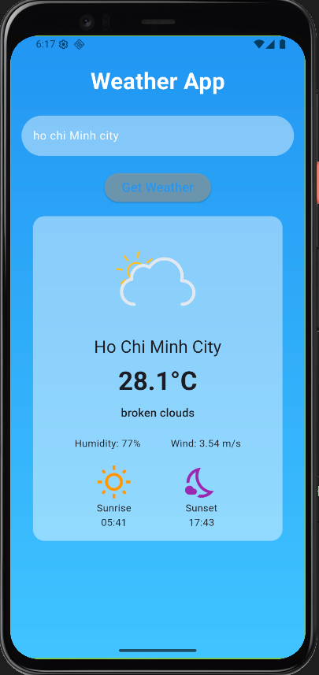
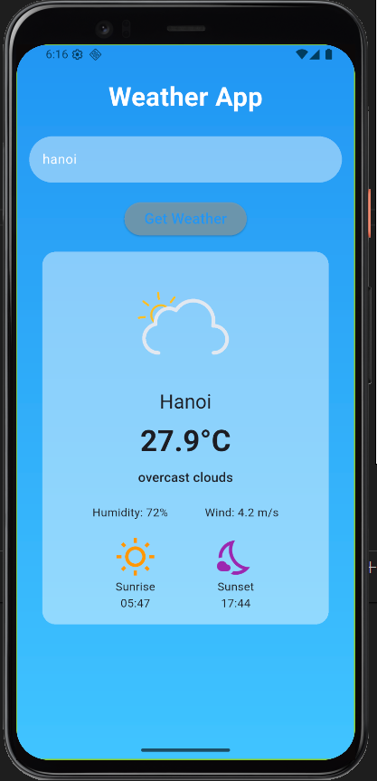

# 🌤️ Weather App

A simple Flutter application that displays real-time weather information using the **OpenWeatherMap API**.

## 🚀 Features
- Search weather by city name  
- Display:
  - Current temperature (°C)  
  - Humidity  
  - Wind speed  
  - Sunrise & Sunset time  
- Dynamic background based on weather conditions (clear, cloudy, rainy)  
- Beautiful animations powered by **Lottie**  

## 📸 Demo
<p align="center">
  
  
</p>

## 🛠️ Installation

1. Clone the repository:
   ```bash
   git clone https://github.com/trinhdz/weatherapp.git
   cd weatherapp
2. Install dependencies:

   flutter pub get


3. Get your API key from OpenWeatherMap 

[**https://openweathermap.org/api**](https://)

Replace the apikey in lib/models/services/weather_service.dart

`final String apikey = 'YOUR_API_KEY';`


Run the app:

`flutter run`

4. Dependencies

http
 – API calls

intl
 – Date & time formatting

lottie
 – Weather animations

- [Lab: Write your first Flutter app](https://docs.flutter.dev/get-started/codelab)
- [Cookbook: Useful Flutter samples](https://docs.flutter.dev/cookbook)

For help getting started with Flutter development, view the
[online documentation](https://docs.flutter.dev/), which offers tutorials,
samples, guidance on mobile development, and a full API reference.
